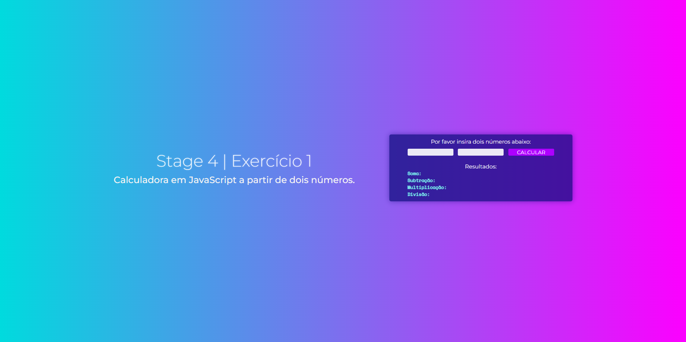

# Desafio 5: Aula 04 | Rocketseat Explorer 🚀

Desafio de calculadora básica em JavaScript da Aula 4 do curso [Explorer](https://app.rocketseat.com.br/explorer) da Rocketseat. O explorer é um curso full-stack que ensina a programar desde o nível mais básico. 
Neste desafio, a proposta era criar uma calculadora simples em JavaScript que devolvesse os resultados das operações básicas a partir de dois números. Optei por fazer um layout com CSS e HTML para deixar o exercício mais visual.
  
🔗 [Clique aqui para ver o site!](https://mariak-fla.github.io/desafio5-RS/)

## ⚙️ Tecnologias

- JavaScript
- HTML
- CSS
- Git
- Github