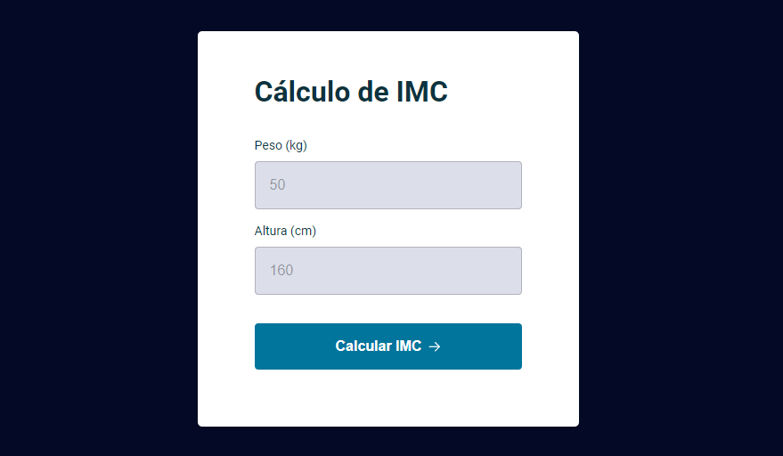

# Exercícios de JavaScript
*PT-BR:* Exercícios simples em JavaScript para praticar conforme aprendo. 😊 
*EN-US:* Simple practice exercises I made while learning JavaScript. 😊

## Desafio 5: Stage 04 | Rocketseat Explorer 🚀
 
Desafio de calculadora básica em JavaScript do Stage 4 do curso [Explorer](https://app.rocketseat.com.br/explorer) da Rocketseat. O explorer é um curso full-stack que ensina a programar desde o nível mais básico. 
Neste desafio, a proposta era criar uma calculadora simples em JavaScript que devolvesse os resultados das operações básicas a partir de dois números. Optei por fazer um layout com CSS e HTML para deixar o exercício mais visual.
  
🔗 [Clique aqui para ver o site!](https://mariak-fla.github.io/exercicios-JS/calculadora-simples)

## Desafio 6: Stage 05 | Rocketseat Explorer 🚀
 
Desafio de jogo de adivinhação em JavaScript do Stage 5 do curso [Explorer](https://app.rocketseat.com.br/explorer) da Rocketseat. 
Neste desafio, a proposta era criar um sistema que aleatorizasse um número entre 0 e 10 e uma interface em que o usuário pudesse tentar adivinhar o número.
  
🔗 [Clique aqui para ver o site!](https://mariak-fla.github.io/exercicios-JS/jogo-adivinhacao)

## Desafio 7: Stage 05 | Rocketseat Explorer 🚀
 
Desafio de jogo de adivinhação em JavaScript do Stage 5 do curso [Explorer](https://app.rocketseat.com.br/explorer) da Rocketseat. 
Neste desafio, a proposta era criar uma calculadora de IMC.
  
🔗 [Clique aqui para ver o site!](https://mariak-fla.github.io/exercicios-JS/calculadora-imc)

## Desafio 8: Stage 05 | Rocketseat Explorer 🚀
 
Desafio de Temporizador Pomodoro em JavaScript do Stage 5 do curso [Explorer](https://app.rocketseat.com.br/explorer) da Rocketseat. 
Neste desafio, a proposta era criar um temporizador do estilo Pomodoro, em que o usuário determine uma quantia de minutos no início e um alarme toque ao final. Além disto, o alarme conta com controles de pausa e reinício, som, e música de fundo.
  
🔗 [Clique aqui para ver o site!](https://mariak-fla.github.io/exercicios-JS/pomodoro)

## ⚙️ Tecnologias

- JavaScript
- HTML
- CSS
- Git
- Github
